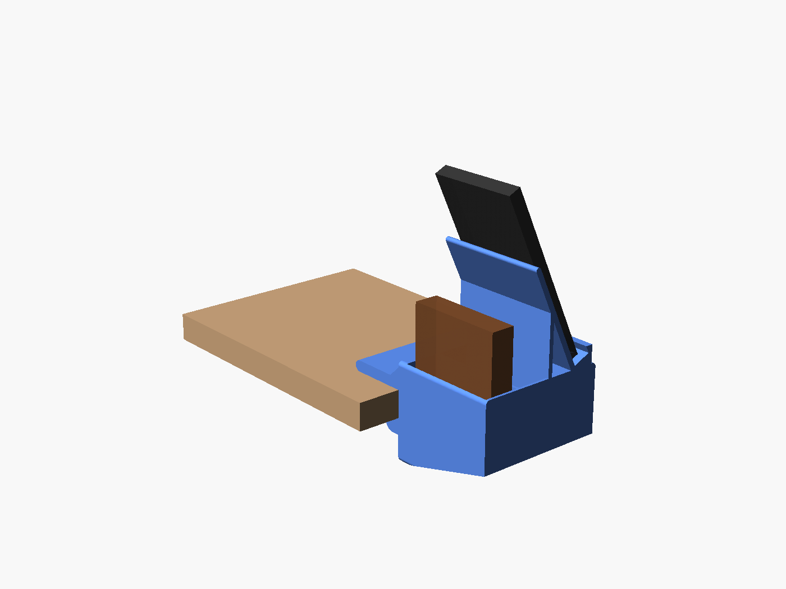

# Clamp-on desk organizer with phone stand

Clamps to the side edge of a desk. At the front there's a phone stand that faces you, and behind it a keys cup and a wallet pocket. The stand is sized for a **Samsung Galaxy S23 Ultra** in a case and holds it in portrait or landscape. A cable hole under the phone lets you charge it on the stand. The clamp tightens with a printed screw and nut, so you don't need any hardware.


## Files

| File | What it is |
|---|---|
| `desk_organizer_LEFT_side_one_plate.stl` | Everything on one plate (body, screw, nut) for the **left** side of your desk, as you sit at it |
| `desk_organizer_RIGHT_side_one_plate.stl` | The same, mirrored for the **right** side |
| `desk_organizer.scad` | Editable source (OpenSCAD + BOSL2) |

Print **one** of the two STLs. Each holds all three parts, already arranged for one P2S plate. On both versions the phone stand ends up at the front, nearest you.

## What it fits

- **Phone:** Galaxy S23 Ultra (163.4 × 78.1 × 8.9 mm). The ledge takes a phone and case up to 17 mm thick, so most cases fit, rugged ones included.
- **Stand angle:** leans back 25° from upright (65° from the desk). The lip covers only the bottom few millimetres of the screen.
- **Desk thickness:** 9–40 mm.
- **Under the desk:** about 55 mm of clear space under the edge where it mounts.
- **Wallet:** up to 88 mm wide and 28 mm thick.
- **Keys cup:** 30 × 92 mm, 40 mm deep.

## Printing (Bambu Studio, PLA)

1. Open the STL in Bambu Studio. If it asks whether to load the file as one object or several, either is fine.
2. Don't rotate anything. The parts are already turned the right way.
3. Turn **supports off**. The only overhangs are short bridges across the pockets and the screw threads, which the P2S prints cleanly.
4. Use **0.20 mm Standard**. 3 wall loops make the clamp stronger; 2 is fine for light use.

- **Plate:** about 171 × 184 mm, and 157 mm tall.
- **Filament:** about 280 g of PLA at 2 walls and 15% infill. Bambu Studio shows the exact grams and time for your settings. It's a long print.


## Putting it together

1. Drop the nut into the hex pocket on the inside of the lower jaw.
2. Thread the screw up into the nut from below.
3. Slide the organizer onto the desk edge so the top jaw rests on the desk.
4. Tighten the knob by hand until it's snug. Don't crank it: PLA can crack if you overtighten.
5. Optional: stick a felt or rubber pad on the screw tip and under the top jaw to protect the desk.
6. To charge in place, feed a USB-C cable up through the hole in the ledge, then rest the phone on the stand.

If the screw is too tight in the nut, raise `thread_slop` (try 0.25) and reprint.



## Changing sizes

Open `desk_organizer.scad` in [OpenSCAD](https://openscad.org) with the [BOSL2](https://github.com/BelfrySCAD/BOSL2) library installed. Change the numbers at the top:
- `stand_angle`, `stand_ledge`, `backrest_len` for the phone stand
- `desk_max` for the desk thickness
- `wallet_w` and `keys_w` for the pockets

Then export:

```
openscad -D 'part="all_in_one"' -D 'mount_side="left"' -o organizer.stl desk_organizer.scad
```
