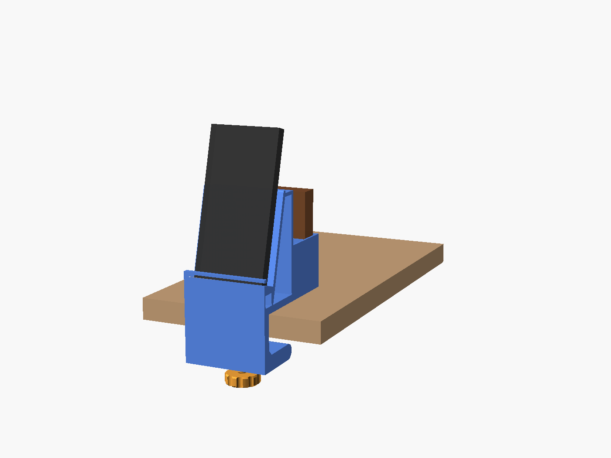
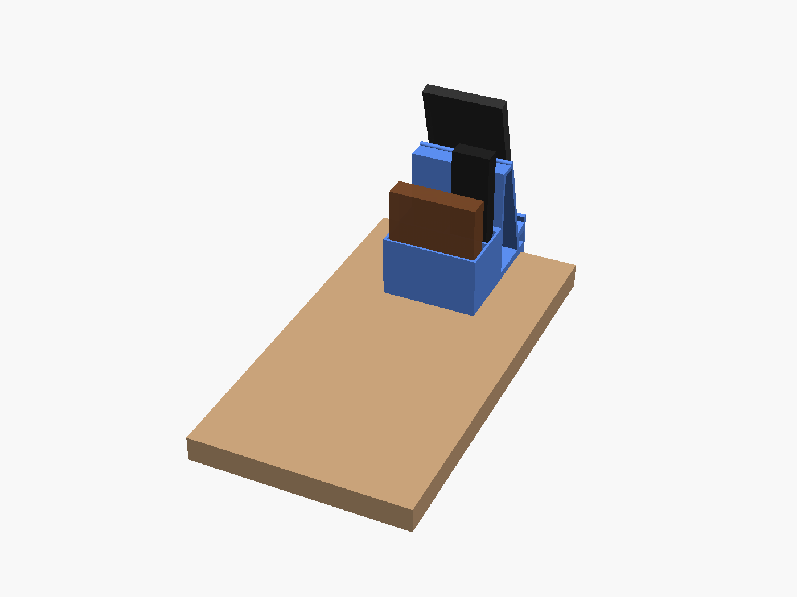

# Clamp-on desk organizer with phone stand

Clamps to the side edge of a desk. The phone stands right at the edge with its screen facing **outward**, so you can watch it from beside the desk, such as from a bed. Behind the stand, sitting on the desk, are a keys cup, a Fire TV remote slot and a wallet pocket. The clamp tightens with a printed screw and nut, so you don't need any hardware.



## Which way the phone faces

- **Right side of the desk:** the screen faces **right**.
- **Left side of the desk:** the screen faces **left**.

It's one STL for either side.


## What it holds

- **Phone:** sized for a Galaxy S23 Ultra (163.4 × 78.1 × 8.9 mm). The ledge takes a phone and case up to 17 mm thick, upright or sideways.
- **Stand angle:** leans back 15° (75° from the desk), so the screen faces someone at about desk height, like you lying in bed. The bottom of the phone sits 28 mm above the desk.
- **Charging:** feed a USB-C cable up through the hole in the ledge. Under the ledge it runs through a tunnel and out either end, along the desk edge.
- **Fire TV remote:** a 44 × 22 mm slot, 60 mm deep. It fits the standard, Enhanced and Pro Alexa Voice Remotes (all 38 mm wide and 16–18 mm thick), and the remote sticks up about 80–100 mm so it's easy to grab.
- **Keys cup:** 45 × 30 mm, 40 mm deep.
- **Wallet:** up to 88 mm wide and 28 mm thick.

The pockets start just behind where the phone's top leans back, so you can lift things out without bumping the phone.



## What it needs

- **Desk thickness:** 9–40 mm.
- **Under the desk:** about 55 mm of clear space under the edge where it mounts.
- **On the desk:** about 97 mm along the edge, and about 126 mm in from the edge. It sticks out only 10 mm past the edge.

## Printing (Bambu Studio, PLA)

1. Open `desk_organizer_one_plate.stl`. It holds the body, screw and nut together. If Bambu Studio asks whether to load it as one object or several, either is fine.
2. Don't rotate anything. The body prints **standing on its end**, with the clamp and stand shapes flat on the plate, which makes them strong.
3. Turn **supports off**. The only overhangs are bridges of 32 mm or less across the ends of the pockets. The P2S prints these fine; you might see a slight sag on the inside end walls.
4. Use **0.20 mm Standard** with **3 wall loops** for a stronger clamp.

- **Plate:** about 190 × 136 mm, and 97 mm tall.
- **Filament:** about 295 g of PLA at 3 walls and 15% infill, or 245 g with 2 walls. Bambu Studio shows the exact amount and time.


## Putting it together

1. Drop the nut into the hex pocket on the inside of the lower jaw.
2. Thread the screw up into the nut from below.
3. Slide the organizer onto the desk edge so the base sits flat on the desk and the phone faces outward.
4. Tighten the knob by hand until it's snug. Don't crank it: PLA can crack if you overtighten.
5. Optional: stick a felt or rubber pad on the screw tip to protect the underside of the desk.

If the screw is too tight in the nut, raise `thread_slop` (try 0.25) and reprint.

## Changing sizes

Open `desk_organizer.scad` in [OpenSCAD](https://openscad.org) with the [BOSL2](https://github.com/BelfrySCAD/BOSL2) library installed. Change the numbers at the top:
- `stand_angle`: lower leans the phone back more; try 65 for viewing from above
- `stand_ledge`, `backrest_len`, `phone_w_max` for the phone stand
- `desk_max` for the desk thickness
- `remote_w`, `remote_t`, `wallet_t` for the pockets

Then export:

```
openscad -D 'part="all_in_one"' -o organizer.stl desk_organizer.scad
```
