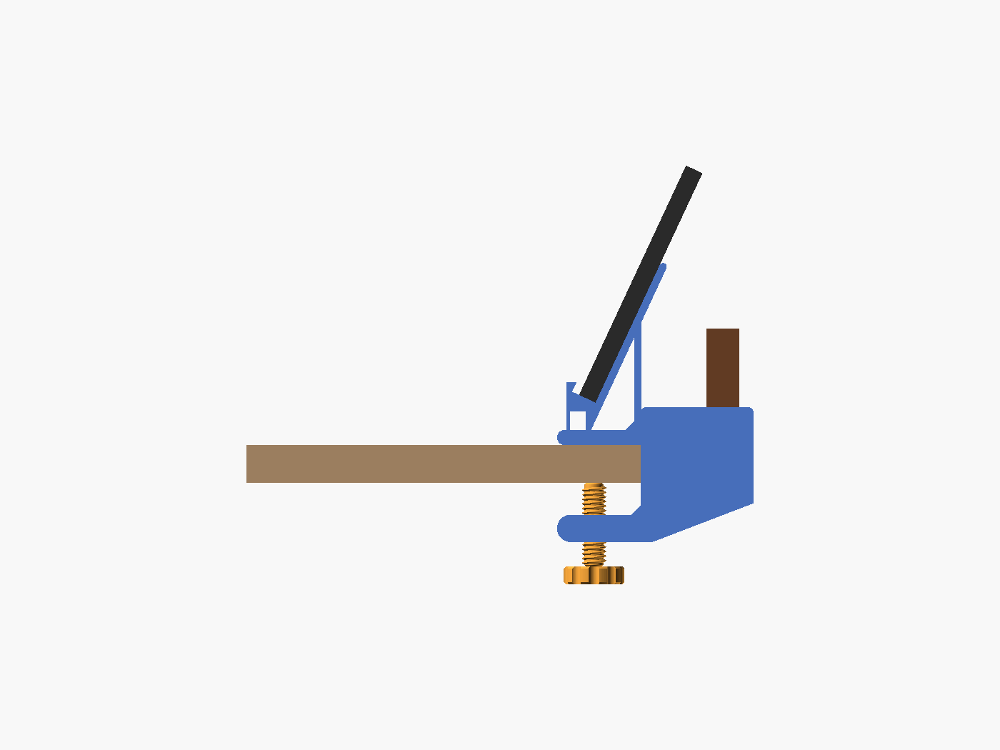

# Clamp-on desk organizer with phone stand

Clamps to the side edge of a desk. The phone stand sits on top of the desk, and its screen faces across the desk toward you. A keys cup and a wallet pocket hang off the desk edge. The stand is sized for a **Samsung Galaxy S23 Ultra** in a case and holds it in portrait or landscape. The clamp tightens with a printed screw and nut, so you don't need any hardware.


## Which way the phone faces

The design is the same for both sides of the desk, so there's only one STL.

- **Left side of the desk:** the screen faces **right**, toward you.
- **Right side of the desk:** the screen faces **left**, toward you.



## Files

| File | What it is |
|---|---|
| `desk_organizer_one_plate.stl` | Body, screw and nut together on one plate. This is the file to print. |
| `desk_organizer.scad` | Editable source (OpenSCAD + BOSL2) |

## What it fits

- **Phone:** Galaxy S23 Ultra (163.4 × 78.1 × 8.9 mm). The ledge takes a phone and case up to 17 mm thick, so most cases fit, rugged ones included.
- **Stand angle:** leans back 25° from upright. The bottom of the phone sits 28 mm above the desk.
- **Charging:** feed a USB-C cable up through the hole in the ledge. Under the ledge it runs through a tunnel and out either end, along the desk edge.
- **Desk thickness:** 9–40 mm.
- **On the desk:** the clamp and stand cover about 55 mm in from the edge. The pockets stick out about 75 mm past the edge.
- **Under the desk:** about 55 mm of clear space under the edge where it mounts.
- **Wallet:** up to 88 mm wide and 28 mm thick.
- **Keys cup:** 30 × 92 mm, 40 mm deep.

## Printing (Bambu Studio, PLA)

1. Open `desk_organizer_one_plate.stl`. If Bambu Studio asks whether to load it as one object or several, either is fine.
2. Don't rotate anything. The body prints **standing on its end**, with the clamp and stand shapes flat on the plate. That way the layers run the strong way through the clamp jaws and the stand.
3. Turn **supports off**. The only overhangs are short bridges, about 30 mm, across the far end of each pocket. The P2S prints them fine; you might see a slight sag on the inside end walls.
4. Use **0.20 mm Standard**. 3 wall loops make the clamp stronger; 2 is fine for light use.

- **Plate:** about 184 × 180 mm, and 97 mm tall.
- **Filament:** about 230 g of PLA at 2 walls and 15% infill. Bambu Studio shows the exact grams and time.


## Putting it together

1. Drop the nut into the hex pocket on the inside of the lower jaw.
2. Thread the screw up into the nut from below.
3. Slide the organizer onto the desk edge so the stand and top jaw rest on the desk.
4. Tighten the knob by hand until it's snug. Don't crank it: PLA can crack if you overtighten.
5. Optional: stick a felt or rubber pad on the screw tip and under the top jaw to protect the desk.

If the screw is too tight in the nut, raise `thread_slop` (try 0.25) and reprint.

## Changing sizes

Open `desk_organizer.scad` in [OpenSCAD](https://openscad.org) with the [BOSL2](https://github.com/BelfrySCAD/BOSL2) library installed. Change the numbers at the top:
- `stand_angle`, `stand_ledge`, `backrest_len`, `phone_w_max` for the phone stand
- `desk_max` for the desk thickness
- `keys_t` and `wallet_t` for the pockets

Then export:

```
openscad -D 'part="all_in_one"' -o organizer.stl desk_organizer.scad
```
