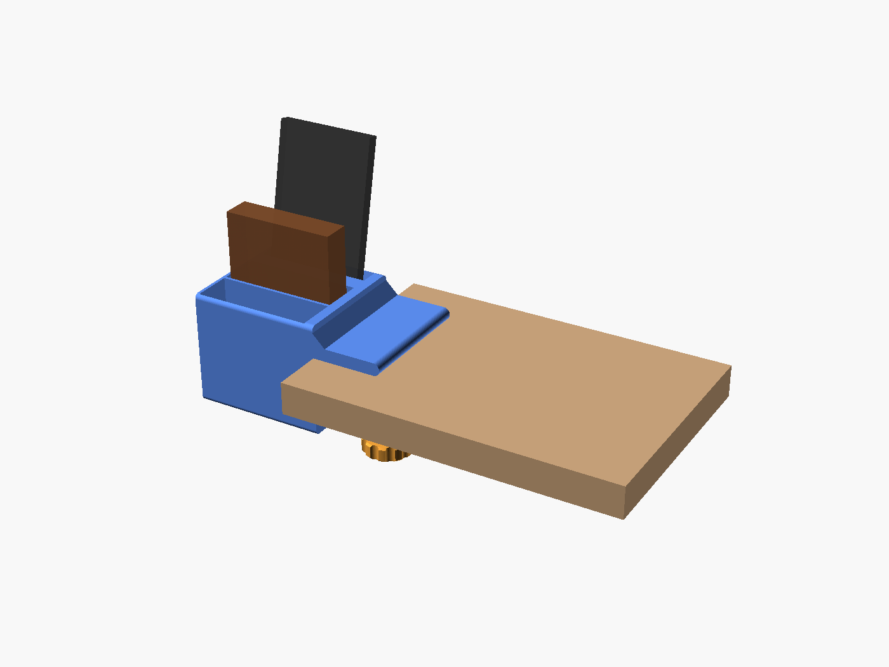
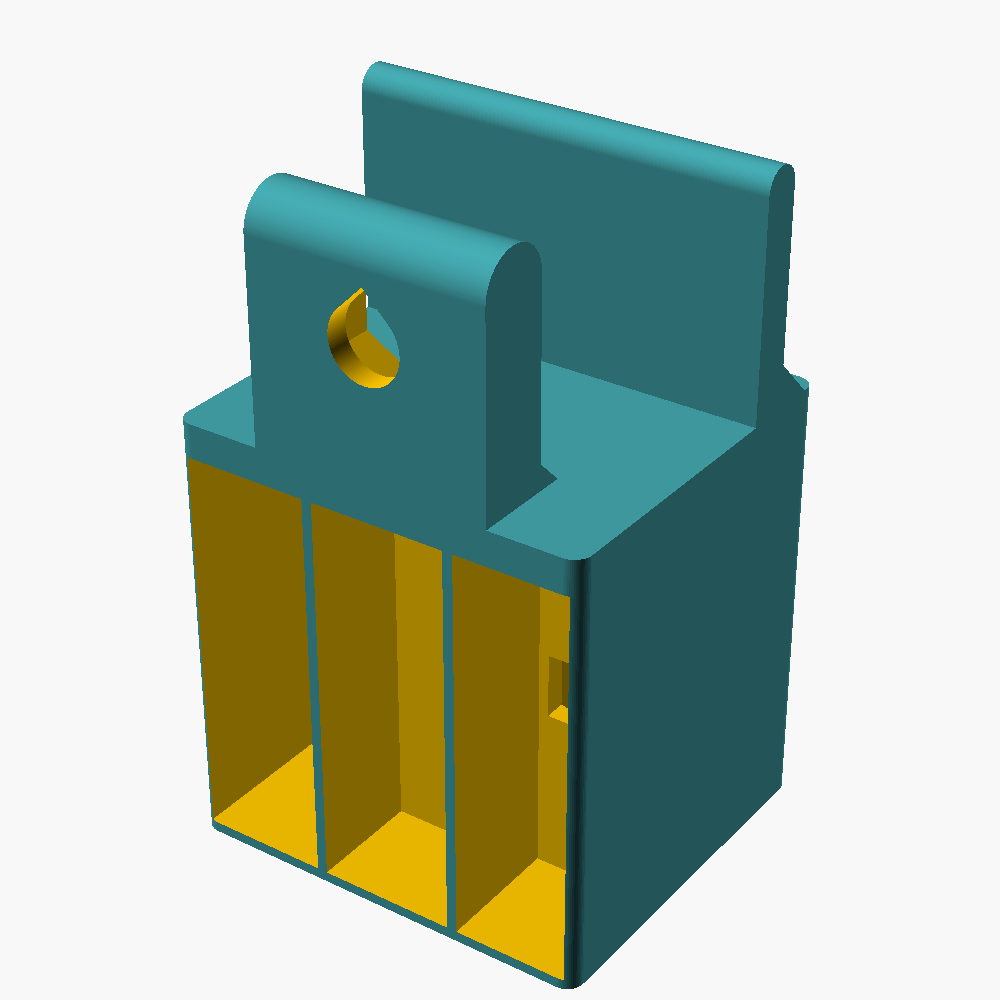

# Clamp-on desk organizer

Clamps to the side edge of a desk and holds keys, a wallet, and a phone. The phone slot leans back 12° and has a hole underneath for a charging cable. The clamp tightens with a printed screw and nut, so you don't need any hardware.



## Files

| File | What it is |
|---|---|
| `organizer_body_LEFT_side.stl` | Body, for the **left** side of your desk (as you sit at it) |
| `organizer_body_RIGHT_side.stl` | Body, mirrored for the **right** side |
| `clamp_screw.stl` | Screw with a knurled knob |
| `clamp_nut.stl` | Nut that sits inside the lower clamp jaw |
| `desk_organizer.scad` | Editable source (OpenSCAD + BOSL2) |

Print **one** body (left or right), plus the screw and the nut. On both bodies the keys cup ends up at the front, nearest you, and the phone at the back.

## What it fits

- **Desk thickness:** 9–40 mm.
- **Under the desk:** about 55 mm of clear space under the edge where it mounts, with no drawer or frame in the way.
- **Phone:** up to about 84 mm wide and 14 mm thick, including its case.
- **Wallet:** up to about 88 mm wide and 28 mm thick, standing on its short edge.
- **Keys cup:** 30 × 88 mm, 40 mm deep.

## Printing (Bambu Studio, PLA)

The STLs are already turned the right way to print. Don't rotate them.

| Part | How it sits | Supports | Suggested settings | Filament* |
|---|---|---|---|---|
| Body | Lying on its outer face, clamp jaws pointing up (157 mm tall) | **None** | 0.20 mm Standard, **3 wall loops**, 15% infill | ~200 g |
| Screw | Knob down | None | 0.16 mm or 0.20 mm, 3 walls, 25% infill | ~11 g |
| Nut | Flat | None | 0.16 mm or 0.20 mm, 3 walls | ~3 g |

\*Measured with a slicer at 2 walls and 15% infill. Bambu Studio shows the exact grams and time for your P2S.

The only overhangs are short bridges (32 mm or less) across the tops of the pockets, which the P2S prints cleanly. Extra wall loops on the body make the clamp jaws stronger.



## Putting it together

1. Drop the nut into the hex pocket on the inside of the lower jaw.
2. Thread the screw up into the nut from below.
3. Slide the organizer onto the desk edge so the top jaw rests on the desk.
4. Tighten the knob by hand until it's snug. Don't crank it: PLA can crack if you overtighten.
5. Optional: stick a felt or rubber pad on the screw tip and under the top jaw to protect the desk.
6. To charge in place, feed the cable up through the hole under the phone slot.

If the screw is too tight in the nut, raise `thread_slop` (try 0.25) and reprint just the nut.

## Changing sizes

Open `desk_organizer.scad` in [OpenSCAD](https://openscad.org) with the [BOSL2](https://github.com/BelfrySCAD/BOSL2) library installed. Change the numbers at the top, such as `desk_max`, `pocket_len`, `phone_slot` and `wallet_w`. Then export each part:

```
openscad -D 'part="body"' -D 'mount_side="left"' -o body.stl desk_organizer.scad
openscad -D 'part="screw"' -o screw.stl desk_organizer.scad
openscad -D 'part="nut"'   -o nut.stl   desk_organizer.scad
```
